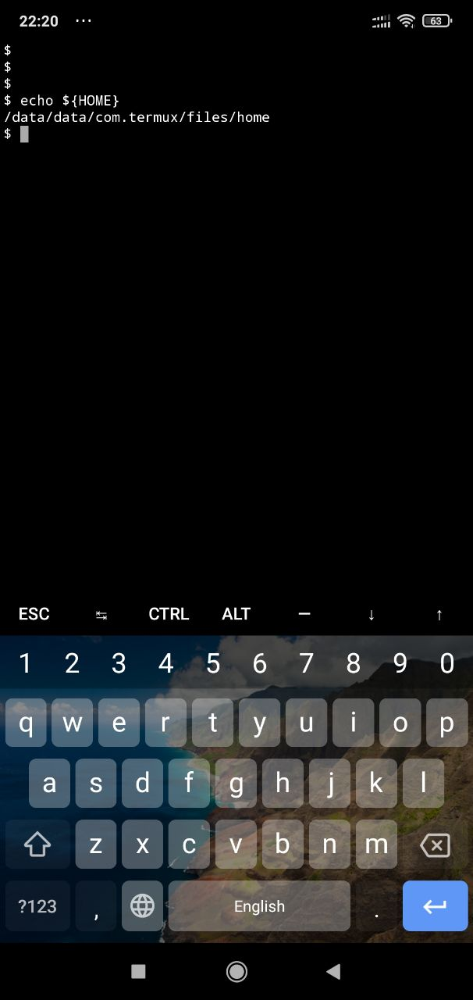
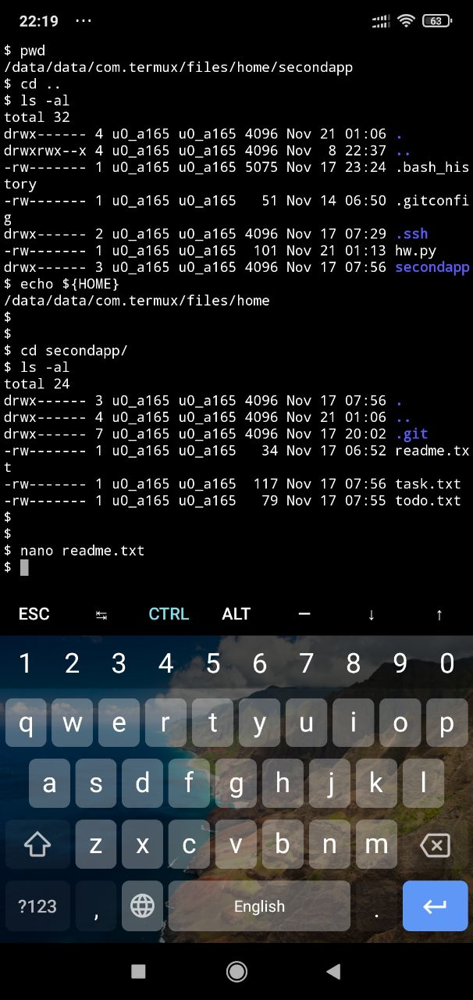
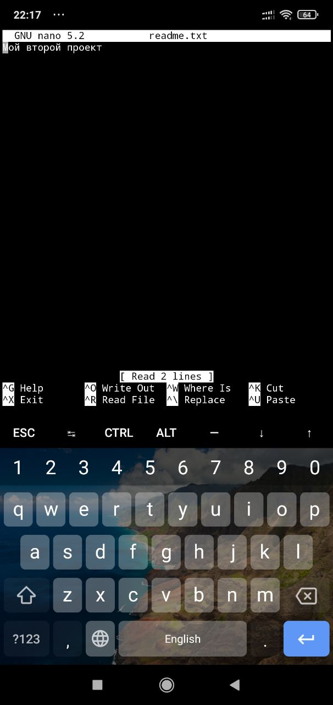

# Гайд по курсу "Основы работы с Git"*
* *в конце гайда бонус*

## Краткое знакомство с базовыми возможностями Git

### Инициализируем локальный репозиторий Git

#### Создать репозиторий в текущей папке: 

```bash
        $ git init
```

#### Создать новую папку с именем "repo_name" и создать в нем репозиторий:

```bash
        $ git init "repo_name"
```

#### Создать репозиторий в указанной директории:

```bash
        $ git init /path/to/repo/
```

#### Удалить каталог из локального репозитория Git:

```bash
        $ cd <папка с репозиторием> # перешли в папку
        $ rm -rf .git # удалили подпапку .git
```


### Настройка локального репозитория Git (заполняем персональными данными файл .gitconfig расположенный в домашнем каталоге)

#### Вносим свое имя или никнейм, ведь благодарные фолловеры должны знать имя своего героя...:

```bash
        $ git config --global user.name "User Name"*
```
*имя или ник нужно написать латиницей и в кавычках


#### ...а также иметь хоть какое то средство связи с ним...:

```bash
        $ git config --global user.email username@yandex.ru*
```
*здесь нужно указать свой настоящий email


#### Но, чтобы благодарные фолловеры не очень быстро смогли вас найти, проверьте, чего понаписали в .gitconfig:

```bash
        $ git config --list
```

### Добавляем файлы в локальный репозиторий Git и коммитим их изменения

#### Создаем файлы к каталоге репозитория:

```bash
        $ touch todo.txt # создали файл todo.txt
        $ touch readme.txt # создали файл readme.txt
```

#### Добавляем созданные файлы в репозиторий Git:

```bash
        $ git add --all # подготовили к сохранению все файлы в репозитории
        $ git add todo.txt # подготовили к сохранению только файл todo.txt в репозитории
        $ git add . # добавили всю текущую папку в репозиторий
        $ git status    #проерили статус (точно ли все нужные файлы добавлены)
```

#### Делаем свой первый commit:

```bash
        $ git commit -m 'Мой первый коммит!'
```

### Просмотр статусов локального репозитория Git

#### Посмотреть историю коммитов текущей ветки:

```bash
        $ git log
```

#### Посмотреть статус файлов в текущем репозитории:

```bash
        $ git status
```

#### Проверка установленной версии Git:

```bash
        $ git version
```


# И еще очень много интересного на курсе Основы работы с Git" от Yandex Практикум. Следующий шаг - знакомимся с самым известным публичным репозиторием GitHub. Но тут самое время перейти по [ссылке](https://practicum.yandex.ru/referrals/?ref_code=gAAAAABllgr86OtnWPTbGPuGTbvPbjrJvkUskGyIcGlRJAyxjsWrTaOLXrEtGhblif6SfdCcZsAvSPtN1-uz6d_TQuS89rzrZg%3D%3D) и зарегистрироваться на курс...


---------------------------------------------------------------------------------------------------------------------------------

# Полезное послесловие (тот самый бонус*)

## Учимся в дороге

### Нудное напутствие (по заданию разные возможности MARKDOWN использовать нужно, так что терпите)

Ученье - свет, а неученых - тьма.
Сказано давно, не нами, и не так, но чертовски верно.
Как быть, если отсутвие свободного времени не позволяет идти к свету? 
Для жителей больших городов, подолгу находящихся в дороге между офисом и домом (только не за рулем!!!), готов поделиться рецептом, как учиться в пути, включая выполнение практических заданий.
Испольуйте свой смартфон. Даже старенький смартфон c ОС Android сгодится для прохождения курса "Основы работы с Git" от Yandex Практикум.
Рекомендации ниже успешно опробованы на Xiaomi Redmi Note 6 Pro , но уверен, доступны и на других смартфонах.

### К делу...

Итак, что вам понадобится для успешного освоения курса "Основы работы с Git" от Yandex Практикум на смартфоне:

1. Приложение [Yandex Практикум](https://play.google.com/store/apps/details?id=ru.yandex.practicum.flutter_practicum "Я укажу тебе дорогу к свету!"), с помощью которого легко и удобно учиться в дороге.


2. Приложение [Termux](https://play.google.com/store/apps/details?id=com.termux "Да пребудет с тобой Сила!"), приложение, котрое позволяет превратить телефон в мини-станцию Linux с терминалом.


3. Браузер, любой, обычно установлен по умолчанию.

Рецепт на самом деле прост:

1. Берем в руки телефон, устранвливаем из Google Play приложение Yandex Практикум, выбираем бесплатные курсы, среди них найдется и тот самый, "Основы работы с Git".
2. Регистрируемся на курсе.
3. Устанавливаем Termux из Google Play
4. Запускаем Termux и устанавливаем в консоли:
    
    -Git*:
    
    ```bash
        $ pkg install git
    ```
    * *главный герой этого романа*
    
    -OpenSSH*:
    
    ```bash
        $ pkg install openssh
    ```
    * *с этим пакетом установится утилита ssh-keygen, используемая в курсе*
    
    -Nano*:
    
    ```bash
        $ pkg install nano
    ```
    * *консольный текстовый редактор с подсветкой синтаксиса различных ЯП. Можно при желании использовать любой графический редактор с GUI и подсветкой синтаксиса, но работать в одном консольном окне (терминал + редактор) по мне удобнее и быстрее, чем перемещаясь между несколькими приложениями. "У каждого свой вкус" - как бывало говаривал кот Васька...*

5. Определяем домашний каталог* пользователя:

    ```bash
        $ echo ${HOME}
    ```
    * *у меня это /data/data/com.termux/files/home, у вас может быть другой путь к домашнему каталогу, важна суть - здесь создаем тренировчные каталоги для курса, которые будем использовать как репозитории git (большой привет от git init), а также каталог .ssh для хранения ключей SSH (такой же большой привет от ssh-keygen)*

    

6. Создаем* в домашнем каталоге скрытый каталог .ssh:

    ```bash
        $ cd ~
        $ mkdir .ssh
        $ ls -al
    ```
    * *первая команда - переход в домашний каталог, вторая команда - создание скрытого каталога .ssh, третья команда - убедиться, что не показалось...*

7. Открываем приложение Yandex Практикум и поехали!

### P.S. пара-тройка советов, которые мне бы сэкономили немало времени:

1. Присмотритесь к возможностям консольного терминала Termux, они позволяют очень споро работать при небольшом навыке:



Несколько удобств*:

CTRL + a - переход в начало строки
CTRL + e - переход в конец строки
CTRL + c  - прервать выполнение любой комады
    ...
ALT + d - удалить целиком слово, расположенное за курсором
    ...
TAB - двойной клик по клавише дополняет команды и пути
Стралка вверх - переход по логу команд терминала к предыдущим (вверх)
Стрелка вниз - переход по логу команд терминала к последующим (вниз)

* *я указал здесь те клавиатурные комбинации, которые испольую в работе регулярно сам, но если интересно - найдете много других интересных комбинаций, которые возможно подойдут именно вам*

2. Присмотритесь к возможностям консольного редактора Nano, они тоже здорово ускоряют работу:



Несколько удобств*:

CTRL + a - переход в начало строки
CTRL + e - переход в конец строки
CTRL + \ - заменить любое слово в тексте на другое
CTRL + o - сохранить изменения в редактируемом файле
CTRL + x - закрыть редактируемый файл (с сохранением или без)
    ...

* *я указал здесь те клавиатурные комбинации, которые испольую в работе регулярно сам, но если интересно - найдете много других интересных комбинаций, которые возможно понравятся вам*

3. Когда будете создавать SSH-ключи (при помощи команды ssh-keygen) не выдумывайте пожалуйста для создаваемых ключей никаких собственных названий!!! Трижды проклянете эти названия, когда у вас и соединение по SSH с GitHub вроде работает, и одновременно синхронизация репозитория на тот же GitHub не проходит из-за проблем с ключами. Оставьте параметры по умолчанию - нервы крепче будут :) 

---------------------------------------------------------------------------------------------------------------------------------